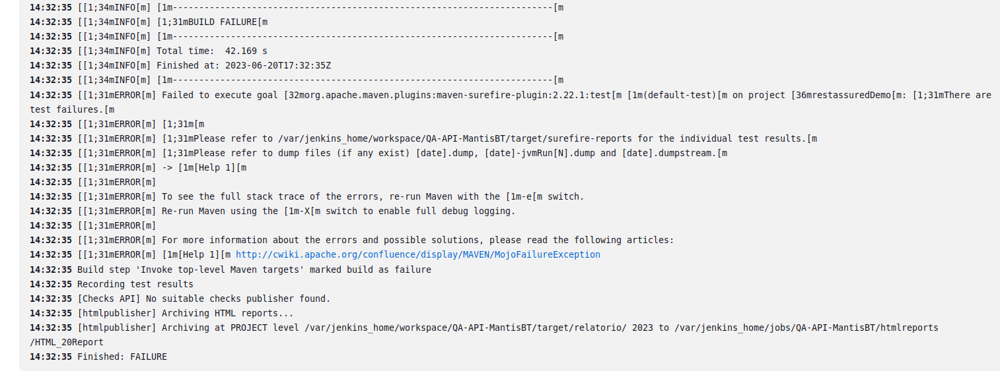
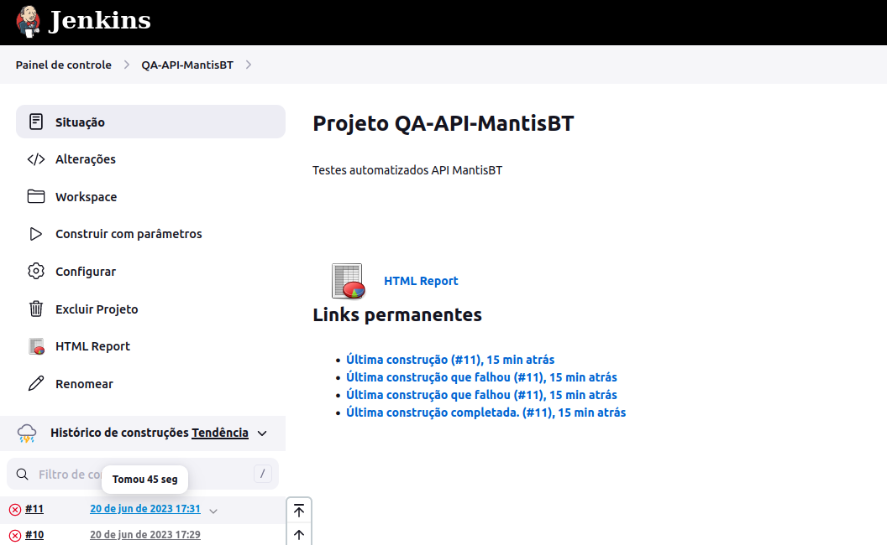
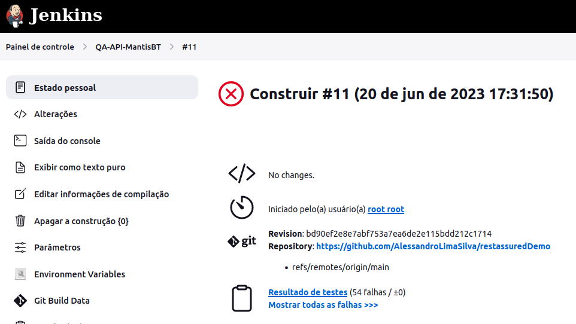
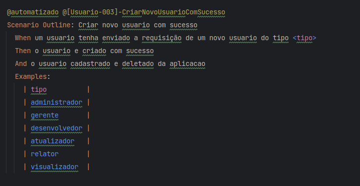
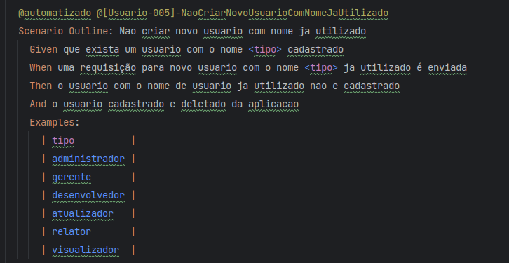
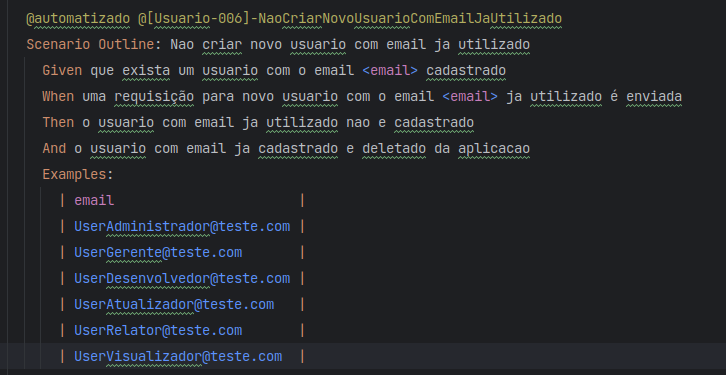
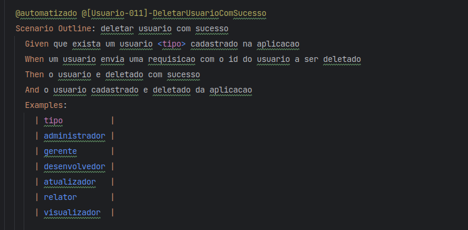
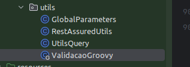

# Framework de Teste de API com RestAssured com Ambiente CI/CD de Testes automatizados

Neste tutorial, vamos explorar como configurar um ambiente CI/CD de testes completo com Docker que contém os contêineres do MantisBT, MySQL e Jenkins, juntamente com o uso do framework de teste de API RestAssured. O ambiente de testes Docker fornecerá uma infraestrutura completa e escalável para executar testes de API do MantisBT API de forma automatizada e controlada.
Ao Final deste tutorial teremos implementado um Pipepline com CI/CD completo de testes automatizados.

## Ambiente de Testes Docker

O ambiente de testes Docker contém os seguintes contêineres:

- **MantisBT**: um sistema de gerenciamento de problemas e rastreamento de defeitos, usado para acompanhar e resolver problemas em um projeto de software.
- **MySQL**: um sistema de gerenciamento de banco de dados relacional, utilizado para armazenar e recuperar dados necessários para os testes.
- **Jenkins**: uma plataforma de automação de CI/CD (Integração Contínua/Entrega Contínua), que permite criar e executar pipelines de testes automatizados.

A combinação do RestAssured com o ambiente de testes Docker nos permite realizar testes completos de ponta a ponta em APIs RESTful, desde a interação com o banco de dados até a validação da interface do usuário.

Vamos começar a aproveitar os benefícios deste ambiente de teste poderoso para automatizar e validar suas APIs RESTful usando o framework RestAssured!


# Framework de Teste de API com RestAssured

Este é um projeto incrível de um framework de teste de API altamente eficiente, desenvolvido para simplificar e agilizar o processo de validação de APIs RESTful. Com base nas bibliotecas mais poderosas e populares do ecossistema Java, este framework oferece uma estrutura robusta e flexível para a automação de testes de API.

## Recursos Destacados

- **Cucumber**: Aproveite o poder do BDD (Behavior-Driven Development) com o Cucumber, uma biblioteca que permite escrever testes em uma linguagem de domínio específica (Gherkin) e executá-los em um formato legível para não desenvolvedores. Isso facilita a colaboração entre equipes técnicas e não técnicas.

- **RestAssured**: Simplifique a validação de APIs RESTful com o RestAssured, uma biblioteca Java poderosa e intuitiva que oferece uma sintaxe amigável para a criação de testes de integração de API. Através do RestAssured, você pode facilmente enviar requisições HTTP, validar respostas, extrair dados e muito mais.

- **JUnit 4**: Aproveite os recursos do JUnit 4, um framework de teste unitário amplamente utilizado para Java. Ele permite que você defina casos de teste individuais, organize-os em suítes de testes e execute-os com eficiência. O JUnit 4 também oferece recursos avançados, como anotações de configuração e assertivas poderosas.

- **Extent Reporter**: Desfrute de relatórios de testes detalhados e atraentes com o Extent Reporter, uma biblioteca que oferece recursos avançados de geração de relatórios. Com o Extent Reporter, você terá uma visão clara sobre o status dos testes executados, métricas de desempenho e resultados.

- **Jackson Databind**: O Jackson Databind é uma biblioteca de serialização e desserialização JSON muito popular no ecossistema Java. Com ele, você pode converter facilmente objetos Java em formato JSON e vice-versa. Ele fornece uma maneira simples e eficiente de trabalhar com dados JSON em seus testes de API.

- **MySQL**: Aproveite a integração com o MySQL para armazenar e gerenciar dados em seus testes. O MySQL é um sistema de gerenciamento de banco de dados relacional amplamente utilizado, conhecido por sua confiabilidade e desempenho. Com o MySQL, você pode criar tabelas, inserir dados, realizar consultas e muito mais, tornando-o uma escolha poderosa para o armazenamento e recuperação de dados em seus testes.


## Configuração e Execução
    
### Pré-requisitos
### Hardware:
- Processador: Intel Core i7-7700HQ ou AMD Ryzen 5600G
- Memória RAM: 16 GB
- Armazenamento: 20GB de espaço livre
- Conectividade: Acesso à Internet estável

### Software:

#### S.O Ubuntu 22.04 : 
<details>
  <summary>Como instalar o Ubuntu 22.04</summary>

## Passo a passo para instalar o Ubuntu 22.04:

1. Faça o download da imagem ISO do Ubuntu 22.04 no [site oficial do Ubuntu](https://releases.ubuntu.com/22.04/).

2. Grave a imagem ISO em um disco ou crie um pendrive inicializável. Você pode usar ferramentas como o [Etcher](https://etcher.io/) ou o [Rufus](https://rufus.ie/) para criar um pendrive inicializável.

3. Insira o disco ou o pendrive inicializável no computador onde deseja instalar o Ubuntu 22.04.

4. Reinicie o computador e acesse a configuração de inicialização (geralmente pressionando "F2" ou "Del" durante a inicialização, mas pode variar dependendo do fabricante do seu computador).

5. Na configuração de inicialização, defina a opção de inicialização para o disco ou o pendrive inicializável.

6. Salve as configurações e saia da configuração de inicialização. O computador reiniciará e será inicializado a partir do disco ou do pendrive.

7. Siga as instruções na tela para instalar o Ubuntu 22.04. Você poderá escolher o idioma, definir as configurações regionais e particionar o disco, se necessário.

8. Durante a instalação, você também precisará fornecer informações como nome de usuário, senha e outros detalhes específicos.

9. Após a conclusão da instalação, reinicie o computador e inicialize no Ubuntu 22.04 a partir do disco rígido.

10. Parabéns! Agora você tem o Ubuntu 22.04 instalado no seu computador. Você pode começar a explorar e usar o sistema operacional.

</details>

#### OpenJDK 1.8 :
<details>
  <summary>Como instalar o OpenJDK 1.8 e configurar as variáveis de ambiente</summary>

## Passo a passo para instalar o OpenJDK 1.8 e configurar as variáveis de ambiente:

1. Abra o terminal pressionando "Ctrl + Alt + T" no teclado.

2. Execute o seguinte comando para instalar o OpenJDK 1.8:

   ```
   sudo apt update
   sudo apt install openjdk-8-jdk
   ```

3. Após a instalação, verifique se o Java foi instalado corretamente executando o seguinte comando:

   ```
   java -version
   ```

   Isso exibirá a versão do Java instalada no seu sistema. Deve mostrar algo semelhante a:

    ```
    openjdk version "1.8.x_xxx"
    OpenJDK Runtime Environment (build 1.8.x_xxx-ubuntu0.xx.xx.xx)
    OpenJDK 64-Bit Server VM (build 25.x_xxx-ubuntu0.xx.xx.xx, mixed mode)
    ```

4. Agora, vamos configurar as variáveis de ambiente para o OpenJDK 1.8. Abra o arquivo `/etc/environment` com um editor de texto usando o seguinte comando:

   ```
   sudo nano /etc/environment
   ```

5. Adicione a seguinte linha ao arquivo, substituindo `/usr/lib/jvm/java-8-openjdk-amd64` pelo caminho correto da instalação do OpenJDK 1.8 em seu sistema:

   ```
   JAVA_HOME=/usr/lib/jvm/java-8-openjdk-amd64
   ```

6. Pressione "Ctrl + X" para sair do editor de texto, pressione "Y" para confirmar as alterações e pressione Enter para salvar o arquivo com o mesmo nome.

7. Execute o seguinte comando para recarregar as variáveis de ambiente:

   ```
   source /etc/environment
   ```

8. Agora, vamos adicionar o diretório do Java ao PATH do sistema. Abra o arquivo `~/.bashrc` com um editor de texto usando o seguinte comando:

   ```
   nano ~/.bashrc
   ```

9. Adicione a seguinte linha ao final do arquivo:

   ```
   export PATH="$PATH:$JAVA_HOME/bin"
   ```

10. Pressione "Ctrl + X" para sair do editor de texto, pressione "Y" para confirmar as alterações e pressione Enter para salvar o arquivo com o mesmo nome.

11. Execute o seguinte comando para recarregar o arquivo `~/.bashrc`:

    ```
    source ~/.bashrc
    ```

12. Agora você tem o OpenJDK 1.8 instalado e as variáveis de ambiente configuradas corretamente. Você pode começar a usar o Java 8 em seu sistema.

</details>


#### Docker 20.10.24
<details>
  <summary>Como instalar o Docker no Ubuntu 22.04</summary>

## Passo a passo para instalar o Docker no Ubuntu 22.04:

1. Abra o terminal pressionando "Ctrl + Alt + T" no teclado.

2. Remova versões antigas do Docker, se existirem, executando o seguinte comando:

   ```
   sudo apt remove docker docker-engine docker.io containerd runc
   ```

3. Atualize a lista de pacotes com o seguinte comando:

   ```
   sudo apt update
   ```

4. Instale os pacotes necessários para permitir que o apt utilize repositórios via HTTPS, executando o seguinte comando:

   ```
   sudo apt install apt-transport-https ca-certificates curl gnupg-agent software-properties-common
   ```

5. Adicione a chave GPG oficial do Docker executando o seguinte comando:

   ```
   curl -fsSL https://download.docker.com/linux/ubuntu/gpg | sudo gpg --dearmor -o /usr/share/keyrings/docker-archive-keyring.gpg
   ```

6. Adicione o repositório do Docker às fontes do APT, executando o seguinte comando:

   ```
   echo "deb [arch=amd64 signed-by=/usr/share/keyrings/docker-archive-keyring.gpg] https://download.docker.com/linux/ubuntu $(lsb_release -cs) stable" | sudo tee /etc/apt/sources.list.d/docker.list > /dev/null
   ```

7. Atualize a lista de pacotes novamente, agora incluindo o repositório do Docker, com o seguinte comando:

   ```
   sudo apt update
   ```

8. Agora, você pode instalar o Docker executando o seguinte comando:

   ```
   sudo apt install docker-ce docker-ce-cli containerd.io
   ```

9. Após a conclusão da instalação, verifique se o Docker foi instalado corretamente executando o comando:

   ```
   docker --version
   ```

   Isso exibirá a versão do Docker instalada no seu sistema.

10. Parabéns! Agora você tem o Docker instalado no Ubuntu 22.04. Você pode começar a usar o Docker para criar e gerenciar contêineres.

</details>

#### Intellij Idea Community version 2023.1.2
<details>
  <summary>Como instalar o IntelliJ IDEA Community</summary>

## Passo a passo para instalar o IntelliJ IDEA Community:

1. Abra o terminal pressionando "Ctrl + Alt + T" no teclado.

2. Faça o download do arquivo de instalação do IntelliJ IDEA Community Edition no [site oficial da JetBrains](https://www.jetbrains.com/idea/download).

3. Navegue até o local onde o arquivo de instalação foi baixado.

4. Extraia o arquivo de instalação usando o seguinte comando:

   ```
   tar -xzf nome_do_arquivo.tar.gz
   ```

5. Acesse o diretório extraído usando o seguinte comando:

   ```
   cd nome_do_diretorio
   ```

6. Execute o script de instalação usando o seguinte comando:

   ```
   ./bin/idea.sh
   ```

7. O IntelliJ IDEA Community será iniciado e você será guiado pelo assistente de configuração inicial.

8. Siga as instruções na tela para configurar suas preferências, como temas, plugins, esquemas de teclado, etc.

9. Após a configuração inicial, o IntelliJ IDEA Community Edition estará pronto para uso.

10. Parabéns! Agora você tem o IntelliJ IDEA Community Edition instalado no seu sistema. Você pode começar a desenvolver aplicativos usando o IntelliJ IDEA.

</details>

#### Firefox ou qualquer navegador de sua preferencia

#### Instalação do Firefox no Ubuntu 22.04
 <details>
        <summary>Clique aqui para ver o passo a passo de instalação</summary>

- #### Passo 1: Abrir o Terminal

    #### Abra o terminal no Ubuntu. Você pode fazer isso pressionando `Ctrl + Alt + T` no teclado ou pesquisando por "Terminal" no menu de aplicativos.

- #### Passo 2: Verificar a disponibilidade do Snap

    #### O Ubuntu 22.04 inclui o Snap por padrão. Para verificar se o Snap está instalado, execute o seguinte comando no terminal:
    ```bash
    snap version
    ```
    #### Se o Snap estiver instalado, você verá a versão do Snap instalada no seu sistema. Caso contrário, você pode instalar o Snap executando o seguinte comando :
    ```bash
    sudo apt update
    sudo apt install snapd
    ```
- #### Passo 3: Instalar o Firefox via Snap
  
    #### Para instalar o Firefox usando o Snap, execute o seguinte comando no terminal:
    ```bash
    sudo snap install firefox
    ```
    #### Digite Y ou S quando solicitado para confirmar a instalação. O sistema irá baixar e instalar o Firefox via Snap.  

- #### Passo 4: Verificar a Instalação

  #### Após a instalação, você pode verificar se o Firefox foi instalado corretamente executando o seguinte comando no terminal:    
  ```bash
    sudo snap install firefox
    ```
    
</details>

#### Portas de rede : 80, 8989, 3606, 8080, 8081, 50000

#### Usuario root no Ubuntu

## Configuração do ambiente de teste
Neste passo iremos configurar a estrutura de pastas do nosso ambiente, junto a isso iremos subir o nosso ambiente de teste.

Para começar a utilizar este framework de teste de API, siga estas etapas:
- ### Configurando a estrutura de arquivos e clonando o repositorio Git 
  1. Abra o terminal pressionando "Ctrl + Alt + T" no teclado.

     - #### crie uma pasta com o nome git em Documentos
        ```bash
        mkdir ~/Documentos/git/
        ```
     - #### crie uma pasta com o nome docker em Documentos
        ```bash
        mkdir ~/Documentos/docker/
        ``` 
     - #### Navegue até o diretório, no terminal
        ```bash
        cd ~/Documentos/git/
        ```
     - #### No terminal realize o clone do repositorio 
        ```bash
        git clone https://github.com/AlessandroLimaSilva/restassuredDemo.git
       ```
     - #### No terminal acesse a pasta
        ```bash
        cd ~/Documentos/git/restassuredDemo
        ```
     - #### Copie os arquivo docker-compose.yml, jenkinsFile, plugins.txt para a pasta Documentos/docker  
        ```bash
        cp ~/Documentos/git/restassuredDemo/docker-compose.yml ~/Documentos/docker/
        ```
     - #### Copie os arquivo docker-compose.yml, jenkinsFile, plugins.txt para a pasta Documentos/docker
        ```bash 
        cp ~/Documentos/git/restassuredDemo/jenkinsFile ~/Documentos/docker/
        ```
     - #### Copie os arquivo docker-compose.yml, jenkinsFile, plugins.txt para a pasta Documentos/docker
        ```bash
        cp ~/Documentos/git/restassuredDemo/plugins.txt ~/Documentos/docker/
        ```
- ### Iniciando o ambiente de teste  
  #### Agora que ja temos nossa estrutura de arquivos esta configurada podemos subir o ambiente
  1. Abra o terminal pressionando "Ctrl + Alt + T" no teclado.

      - #### Acesse a pasta Documentos/docker
         ```bash
         cd ~/Documentos/git/
         ```
      - #### Iniciando o Docker
         ```bash
         sudo docker-compose -f docker-compose.yml up -d
         ```
      - #### Aguarde o docker realizar o download dos container e suas dependencias, ao finalizar voce ira ver no terminal.
         ```bash
         [+] Running 4/4
          ✔ Network docker_my-networks   Created                                    0.1s
          ✔ Container docker-mysql-1     Started                                    2.7s
          ✔ Container jenkins            Started                                    2.9s
          ✔ Container docker-mantisbt-1  Started                                    1.3s
         ```
        
      - #### conferindo se o ambiente de teste foi iniciado corretamente
         ```bash
        sudo docker ps -a
        CONTAINER ID   IMAGE                      COMMAND                  CREATED              STATUS              PORTS                                                                                      NAMES
        e8b5c06810f2   vimagick/mantisbt:latest   "docker-php-entrypoi…"   About a minute ago   Up About a minute   0.0.0.0:8989->80/tcp, :::8989->80/tcp                                                      docker-mantisbt-1
        48a433718ca3   docker-jenkins             "/usr/bin/tini -- /u…"   About a minute ago   Up About a minute   0.0.0.0:50000->50000/tcp, :::50000->50000/tcp, 0.0.0.0:8081->8080/tcp, :::8081->8080/tcp   jenkins
        352cf52ae2a3   mysql:5.7                  "docker-entrypoint.s…"   About a minute ago   Up About a minute   0.0.0.0:3306->3306/tcp, :::3306->3306/tcp, 33060/tcp                                       docker-mysql-1
        ```
      - #### Ao final desse passo nosso ambiente ja esta online.

- ### Configurando as aplicações
    Agora que terminamos de configurar nossa estrutura de arquivos podemos configurar as aplicações em nosso ambiente de teste.
- ### Configurando o MantisBT
  #### 1. Abra um navegador e digite na barra de endereço
  #### [http://0.0.0.0:8989/admin/install.php](http://0.0.0.0:8989/admin/install.php)

  #### ou

  #### [http://localhost:8989/admin/install.php](http://localhost:8989/admin/install.php)

  #### 2. Configurando o banco de dados do MantisBT
  A tela de configuração da aplicação MantisBT sera apresentada  
  
  - Preencha os seguintes campos
  - #### Em type of database Selecione
    ```bash
    MySQL Improved
    ```
  - #### Em Hostname (for Database Server) informe
    ```bash
    mysql
    ```
  - #### Em Username (for Database) informe
    ```bash
    root
    ``` 
  - #### Em Password (for Database) informe
    ```bash
    root
    ```
  - #### Em Database name (for Database) informe
    ```bash
    root
    ``` 
  - #### Em Admin Username (to create Database if required) informe
    ```bash
    root
    ```
  - #### Em Admin Password (to create Database if required) informe
    ```bash
    root
    ```     
  - #### Em Default Time Zone selecione
    ```bash
    Sao Paulo
    ```   
  - #### Realize um click em Install/Upgrade Database
    
  
  - #### A seguinte tela sera apresentada
    
  - #### Agora clique em Back to administration
    A tela de configuração da aplicação MantisBT sera apresentada
    
  
  #### 3. Obtendo o token de acesso a API do MantisBT
  Agora iremos obter o token de acesso que ira garantir que nossos testes tenha acesso a API do MantisBT.
  
  - #### Informe o seu nome de usuario 
    ```bash
    Administrator
    ``` 
  - #### Clique em entrar
      

  - #### Informe a sua senha 
    ```bash
    root
    ``` 
  - #### Clique em entrar
    

  - #### Clique em Minha Conta
     

  - #### Clique em Tokens API
    

  - #### Preencha o nome do token com Token, clique em criar token
    

  - #### Copie e guarde o token, este token so é exibido uma vez se voce perder o token é necessario criar outro.
  - vYpgsCjNSf2AE-dVR2Xtqs9asBvXp2Qd
    
  - - #### Lembre-se iremos precisar do token nos passos seguintes

  - ### Configurando o Jenkins
      #### 1. Abra o terminal pressionando "Ctrl + Alt + T" no teclado e digite.
      ```bash
      sudo docker ps -a
      ```
      #### Sera retornado as informações dos container
      ```bash
      code@Nitro:~$ sudo docker ps -a
      CONTAINER ID   IMAGE                      COMMAND                  CREATED       STATUS       PORTS                                                                                      NAMES
      e8b5c06810f2   vimagick/mantisbt:latest   "docker-php-entrypoi…"   4 hours ago   Up 4 hours   0.0.0.0:8989->80/tcp, :::8989->80/tcp                                                      docker-mantisbt-1
      48a433718ca3   docker-jenkins             "/usr/bin/tini -- /u…"   4 hours ago   Up 4 hours   0.0.0.0:50000->50000/tcp, :::50000->50000/tcp, 0.0.0.0:8081->8080/tcp, :::8081->8080/tcp   jenkins
      352cf52ae2a3   mysql:5.7                  "docker-entrypoint.s…"   4 hours ago   Up 4 hours   0.0.0.0:3306->3306/tcp, :::3306->3306/tcp, 33060/tcp                                       docker-mysql-1
      ```    
      #### Iremos copiar o CONTAINER ID do nosso container do Jenkins e no terminal e iremos digitar.
      #### sudo docker exec -it CONTAINER ID bash
      ```bash
      sudo docker exec -it 48a433718ca3 bash 
      ```
      #### Agora estamos acessando o container do jenkins pelo terminal, com isso iremos copiar o password para acessar o jenkins no terminal e digitamos.
      ```bash
      cat /var/jenkins_home/secrets/initialAdminPassword 
      ```
      
      #### Copie o password, precisaremos dele para acessar o jenkins

      #### 2. Abra um navegador e digite na barra de endereço
      #### [http://0.0.0.0:8081/login?from=%2F](http://0.0.0.0:8081/login?from=%2F)

      #### ou

      #### [http://localhost:8081/login?from=%2F](http://localhost:8081/login?from=%2F)
      #### Vamos informar a senha de administrador e clicar em Continuar
      
    
      #### Clique em Instalar as extensões sugeridas, as extensões necessarias ja foram adicionadas no container.
      
      
      #### Agora iremos preencher os campos para criar um usuario administrativo
      - #### Em Nome de usuario informe
      ```bash
      root
      ```
      - #### Em Senha informe
      ```bash
      root
      ```
      - #### Em Confirmar Senha informe
      ```bash
      root
      ```
      - #### Em Nome Completo informe
      ```bash
      root root
      ```
      - #### Em Endereço de Email informe
      ```bash
      root@root.com
      ```
      - #### Clique em Salvar e continuar
      
      - #### Clique em Gravar e Concluir
      
      - #### Clique em Reiniciar
      
      - #### Aguarde o jenkins realizar as configurações, se dentro de 5 minutos a pagina não recarregar sozinha aperte F5 para recarregar a pagina.
      

    #### 3. Agora iremos configurar o job no jenkins para executar os nossos testes de modo continuo CI com o nosso codigo que esta no github.
    #### Agora iremos preencher os campos para realizar o login
      - #### Em Nome de usuario informe
      ```bash
      root
      ```
      - #### Em Senha informe
      ```bash
      root
      ```
      #### Agora clique em entrar
      
    
    #### Clique em nova tarefa
    
    
    #### Informe o nome do teste 
    ```bash
    QA-MantisBT-API
    ```
    
    
    #### Clique em Construir um projeto de software de estilo livre
    

    #### Clique em Tudo certo
    
    
    #### Informe a descrição do projeto 
    ```bash
    Testes automatizados API MantisBT
    ```
    
    
    #### Selecione Esta construção é parametrizada. 
    

    #### Clique em Adicionar parametro
    

    #### Clique em Parametro da senha
    

    #### Preencha Nome 
    ```bash
    TOKEN
    ```
    
  
    #### Agora iremos preencher valor padrão com token que geramos no MantisBT
    ```bash
    vYpgsCjNSf2AE-dVR2Xtqs9asBvXp2Qd
    ```
    

    #### Clique em novamente Adicionar parametro
    

    #### Clique em Parametro de texto
    

    #### Preencha Nome
    ```bash
    AMBIENTE
    ```
    

    #### Agora iremos preencher valor padrão com o ambiente no qual iremos executar os testes
    ```bash
    hml
    ```
    

    #### Clique em Aplicar
    

    #### Clique em Gerenciamento do codigo
    

    #### Clique em Git
    

    #### Preencha Repository URL
    ```bash
    https://github.com/AlessandroLimaSilva/restassuredDemo
    ```
    

    #### Preencha Branch Specifier (blank for 'any')
    ```bash
    */main
    ```
    

    #### Clique em Aplicar
    

    #### Clique em Ambiente de construção
    

    #### Clique em Delete workspace before build starts
    

    #### Clique em Ambiente de construção
    

    #### Clique em Adicionar passo na construção
    

    #### Clique em Executar shell
    

    #### Preencha Command, estamos passando as variaveis que criamos no inicio da configuração.
    ```bash
    sed -i "s|enviroment=.*|enviroment=$AMBIENTE|" src/globalParameters.propeties
    sed -i "s|$AMBIENTE.token=.*|$AMBIENTE.token=$TOKEN|" src/globalParameters.propeties
    ```
    

    #### Clique em Aplicar
    

    #### Clique em Adicionar passo na construção
    

    #### Clique em Chamar alvos Maven de alto nivel
    

    #### Preencha Goals, utilizaremos este passo para montar nosso banco de dados que os utilizaram
    ```bash
    clean verify "-Dcucumber.filters.tags=@MontaOBancoDeDados"
    ```
    

    #### Clique em Adicionar passo na construção
    

    #### Clique em Chamar alvos Maven de alto nivel
    

    #### Preencha Goals
    ```bash
    clean verify "-Dcucumber.filters.tags= @automatizado"
    ```
    

    #### Clique em Ações de pós-construção
    

    #### Clique em Adicionar ação de pós-construção
    

    #### Clique em Publicar relatorio de testes do junit
    

    #### Preencha Relatorio XML de teste
    ```bash
    target/surefire-reports/*.xml
    ```
    

    #### Clique novamente em Adicionar ação de pós-construção
    

    #### Clique Publish HTML reports
    

    #### Clique Adicionar
    

    #### Preencha HTML directory to archive, tenha cuidado para preencher é necessario o espaço antes de 2023, hello bug jenkins. 
    ```bash
    ./target/relatorio/ 2023/
    ```
    

    #### Preencha HTML directory to archive
    ```bash
    index.html
    ```
    

    #### Preencha Report title
    ```bash
    HTML Report
    ```
    

    #### Clique em Aplicar
    

    #### Clique em Salvar
    
    
    #### Agora ja temos nosso job CI/CD configurado no jenkins e pronto para execução dos testes.

## Executando os testes no jenkins
Neste passo iremos executar os testes no job que criamos no passo anterior.
Tambem iremos visualizar os relatorios gerados apos a execução dos testes.

#### Agora iremos preencher os campos para realizar o login
   #### Em Nome de usuario informe
   ```bash
   root
   ```
   #### Em Senha informe
   ```bash
   root
   ```
   #### Agora clique em entrar
   

   #### Agora clique QA-API-MantisBT
   

   #### Agora clique me Construir com parâmetros 
    

   #### O modo como foi configurado o job nos permite construir o teste em ambientes diferentes, so precisamos passar o token e o ambiente.
   - #### Clique em construir, como ja passamos as informações de token e ambiente não precisamos modificar nenhuma informação.
   

   #### Para acompanhar a execução dos testes clique na barra azul
   

   #### Nesta tela podemos acompanhar o log dos nossos testes sendo executados
   
    
   #### Nesta tela podemos visualizar o termino dos testes neste caso tivemos testes que falharam \\^^/, e isso é bom.
   
    
   #### Clique em QA-API-MantisBT.
   

   #### Agora iremos visualizar o resultado do teste atraves do junit.
   - #### Clique no job em que executamos os testes, neste caso o job 11.
   

   #### Clique em resultado de testes.
   

   #### Os resultados dos testes são apresentados.
   

   #### Agora iremos visualizar o resultado do teste atraves do ExtentReport.
   - #### Clique em QA-API-MantisBT.
   

   #### Clique em HTML report.
   

   #### O Nosso relatorio ExtentReport sera apresentado dessa forma pelo jenkins por medida de segurança.
   #### Por isso vamos realizar o download do relatorio do ExtentReporter
   - #### Clique em Back to QA-API-MantisBT
   

   #### Clique em Workspace
   

   #### Clique em target
    

   #### Clique em 2023
   

   #### Clique em (Todos os arquivos em .zip), aguarde o fim do download do relatorio
   

   #### descompacte o arquivo e abra o arquivo index.html, pronto ja podemos visualizar o Relatorio do ExtentReport
    


## Desafios Base 2

### Teste automatizado de API da aplicação MantisBT

##### - [✔] Tarefa concluída

##### - [x] Tarefas pendentes

### 1. [✔] Implementar 50 algoritmos de testes que manipulem uma aplicação cuja interface é uma API REST. 

   ##### Mais de 50 algoritmos de testes unicos de api implementados.
   ##### Software utilizado para os testes MantisBT.

### 2. [✔] Alguns algoritmos de testes devem ler dados de uma planilha Excel para implementar Data-Driven. 

   ##### Implementação de Data-Driven pelo Cucumber.
   
   
   
   

### 3. [✔] Notem que 50 algoritmos de testes podem cobrir mais de 50 casos de testes se usarmos Data-Driven. Em outras palavras, implementar 50 CTs usando data-driven não é a mesma coisa que implementar 50 algoritmos de testes. </summary>

   ##### Mais de 50 casos de testes unicos implementados.

### 4. [✔] O projeto deve tratar autenticação. Exemplo: OAuth2. 

   #### Autenticação via token da API, passada atraves do headers.

### 5. [X] Pelo menos um teste deve fazer a validação usando REGEX (Expressões Regulares). </summary>

   #### Não implementado.

### 6. [✔] Pelo menos um algoritmo de teste deve usar código Groovy / Node.js ou outra linguagem para fazer scripts.. 

#### Implementado uma classe em Groovy [ValidacaoGroovy.groovy](https://github.com/AlessandroLimaSilva/restassuredDemo/blob/main/src/test/java/br/com/ale/restassuredDemo/utils/ValidacaoGroovy.groovy) para realizar um assert



### 7. [✔] O projeto deverá gerar um relatório de testes automaticamente. 

#### O projeto gera automaticamente um relatorio do ExtentReport .


#### O projeto gera automaticamente um relatorio do junit que pode ser visualizado no jenkins .


### 8. [✔] Implementar pelo menos dois ambientes (desenvolvimento / homologação) 

#### O Projeto foi desenvolvido para implementar quantos ambientes forem necessarios.
#### Neste caso foram implementados 3 ambientes hml, dev e local.
#### basta apenas adicionar o ambiente desejado atraves do arquivo [globalParameters.propeties](https://github.com/AlessandroLimaSilva/restassuredDemo/blob/main/src/globalParameters.propeties) e implementar na classe [GlobalParameters.java](https://github.com/AlessandroLimaSilva/restassuredDemo/blob/main/src/test/java/br/com/ale/restassuredDemo/utils/GlobalParameters.java)
#### Na configuração realizada no job do jenkins é passado em qual ambiente o teste sera executado.


#### No jenkins é possivel utilizar 2 ambientes hml e dev.

### 9. [✔] A massa de dados dos testes deve ser preparada neste projeto, seja com scripts carregando massa nova no BD ou com restore de banco de dados. 

#### A construção do banco de dados e a massa de dados é realizada atraves da execução de um algortimo de teste e configurada em um passo anterior a execução dos testes no jenkins.

#### Isso tambem poderia ser feito atraves de um shell script que executaria o caso de teste responsavel por criar e popular o banco de dados utilizado pela automação.
#### Sendo que este workaround so foi implementado, dados que as bibliotecas utilizadas no framework não dispoem de uma solução para executar um metodo antes da execução.


### 10. [✔] Executar testes em paralelo. Pelo menos duas threads (25 testes cada).

#### Dado que nosso testes são executados pelo maven-surefire-plugin.

#### Configurei o paralelismo no maven-surefire-plugin para 4 threads.

#### O cucumber trabalha com paralelismo dividindo cada caso de teste em duas thread uma fica responsavel pela feature e a outra pela execução do teste.
#### Assim temos 2 threads para cada caso de teste, totalizando 8 threads para executar nossos testes.
#### podemos visualizar as threads no log de execução dos testes no jenkins, e local tambem.


### - 11. [✔] Execução ambiente CI/CD Jenkins montado em docker
#### As instruções e arquivos necessarios para construir um ambiente de teste CI/CD estão documentadas nesse repositorio.
#### Assim não é necessario utilizar o servidor de terceiros.

## Personalização e Expansão

Este framework de teste de API é altamente personalizável e pode ser facilmente expandido para atender às necessidades exclusivas do seu projeto. Você pode adicionar novos casos de teste, criar classes utilitárias adicionais e integrar bibliotecas adicionais conforme necessário.

